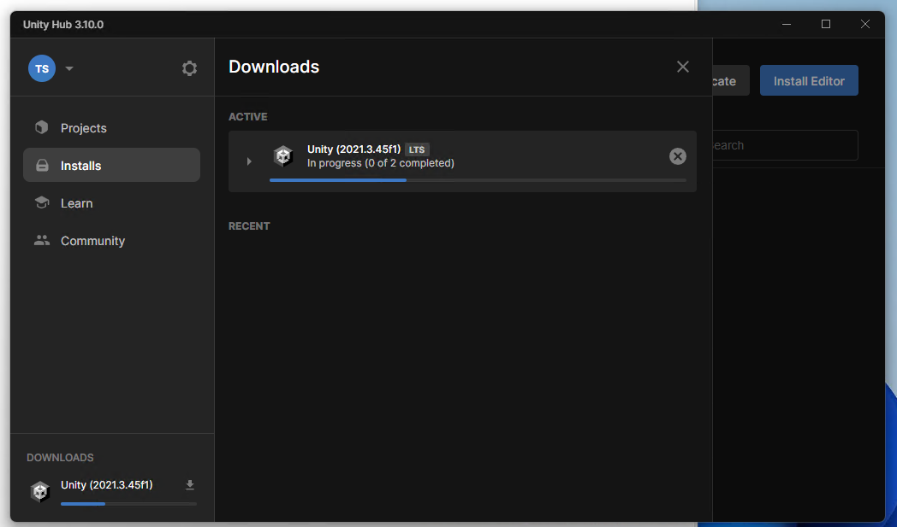

# 事前準備

本特別授業では、以下の準備が必要です。

- Unity の特定バージョンをインストール

## Unity の特定バージョンをインストール

今回は Unity の 2021.3 LTS バージョンを、授業で使います。

参考 : インストールガイド https://unity3d.jp/installguide/

最新の Unity Hub https://unity.com/ja/download インストールします。Install Editor をクリックして

2021.3 台の LTS バージョンの Install ボタンをクリックします。 2024/11/06 時点では 2021.3.45f1 です。

今回は DEV TOOLS の Microsoft Visual Studio Community 2019 のみチェックして Continue をクリックします。

Visual Studio 2019 Community License Terms に移動します。

I have read ～ と書かれているチェックボックスにチェックして Install をクリックします。 

エディタのインストールを待ちます。

Visual Studio 2019 Community のインストールを待ちます。

Visual Studio 2019 のインストール中には、このような画面が出ます。ゲームに関するワークロード「Unityによるゲーム開発」および「C++によるゲーム開発」をチェックしてインストールしてください。 

インストールを待ちます。

インストール後、起動しますが、サインインは後で行う対応で大丈夫です。

ここまでできればインストール完了です！