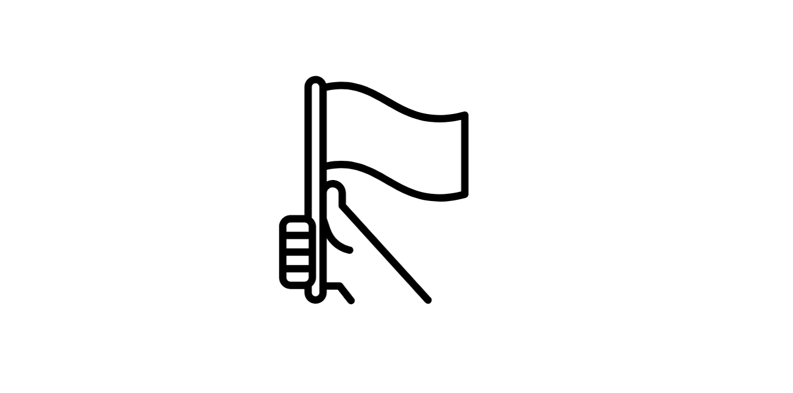

# 2 年生授業トップページ

こちらは 2 年生の授業トップページです。

## 事前準備のお願い

Unity の 2021.3 LTS バージョンを、授業で使います。事前準備ページを参考に準備をお願いします。

すでに Unity をインストール済みの方は 2021 か 2022 台のバージョンであれば十分対応できるコンテンツですので、その場合は事前準備はせず、ご自分の Unity を当日は使っていただいて大丈夫です。

→ [事前準備ページ](./00-preparation.md)

## 講師紹介

田中正吾 タナカセイゴ

屋号ワンフットシーバスにてフリーランスエンジニアで活動。Microsoft MVP・IBM Champion。WEBフロントエンドをベースにしながらも、情報とインターフェースが合わさるアプローチという視点でIoTやMixed Realityといった技術も取り入れながら活動しています。ウォンバットが好き。

- Twitter(X) https://twitter.com/1ft_seabass
- Blog https://1ft-seabass.jp/

## 進行予定

- 1 時限目 90 分
  - 本資料による生成 AI ＋ 3D 連携ハンズオン
- 2 時限目 90 分
  - 本資料による生成 AI ＋ 3D 連携ハンズオン
- 3 時限目 90 分
  - 講師から VR による設備制御ライブデモ＆トーク
- 4 時限目 90 分
  - ここまでを踏まえてざっくばらんに質問タイム（なんでもオッケー）